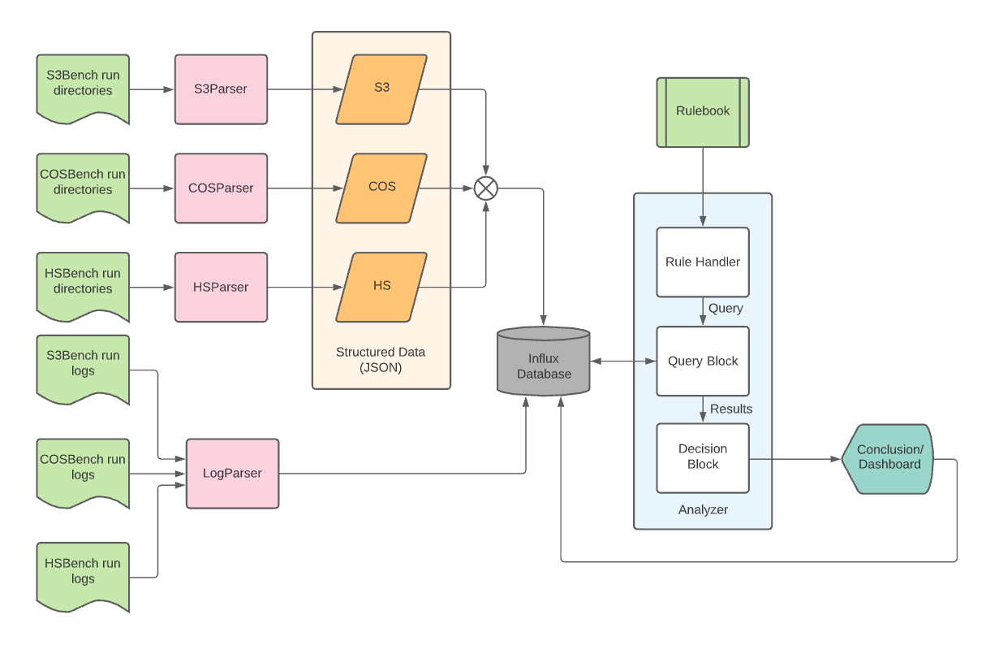

## Analyzer

It is the brain of PerfBot. Objective of the Analyzer is to read rules from the rulebook, understand them and provide inclination of run by analyzing the results. It is the decision making block of the project.

### Analyzer Design

Analyzer is divided into three parts:

1. Rule Handler - Reads rulebook, validates and convert to PerfBot understandable rules
2. Query Block - Reads rules and fires queries on influxDB, compares with expected results
3. Decision Block - Understands the results and decides inclination of run

Design algorithms as follows:

#### Rule Handler:

* For all rules in logs with status == ON:
  * Read custom query if NA:
    * create a function that reads query fields from all rules
    * find a unit of threshold and convert it
    * call functions based on a grouping to create grouping part of the query
    * combine all pieces together and return
  * If not NA:
    * return with custom query
* Collect all queries in a dictionary with key as rule type initial + rule number and value as query
* iterate same for logs rules

#### Queries Block:

* For each key-value pair in rule handler output:
  * Read query from rule handler
  * validate if fields are appropriate and present in the database measurements
  * fire query on the database
  * compare with the "output" value of the rule
    * if matches: declare no violation
    * else: violation occurred
    * store result in a dictionary corresponding rule
  * accumulate results
* return the results

#### Decision block:

* Reference is a lookup table, each for data and logs, where operation of all rules is stored eg. AND, OR etc.
* Read the results from the query block.
* Apply operations on results of every key
* Evaluate final result as good or bad
  * If bad:
    * display every rule label and description
    * display the error lines and error keywords if found
    * display the final result
  * else:
    * only display the final result
  * Display the summary of rules applied during the run
